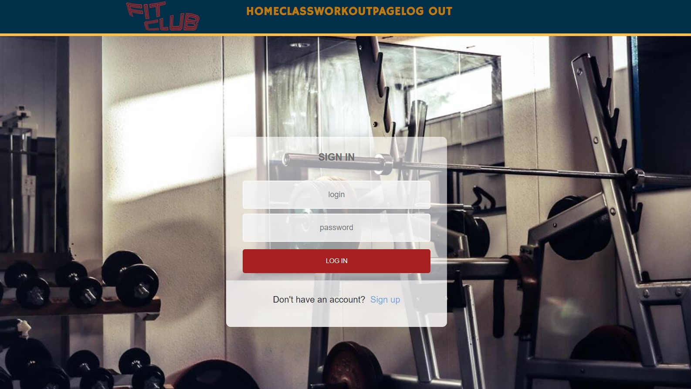

# Fit Club: Social Fitness App

## Description and Purpose
A social fitness application that connects fitness enthusiasts and fitness professionals. The application allows users to share fitness goals and related information with other users and with trainers.

## Table of Contents
  - [Description and Purpose](#description-and-purpose)
  - [Application Screenshot](#application-screenshot)
  - [Deployed Application](#deployed-application)
  - [Built With](#built-with)
  - [License](#license)
  - [Contributing](#contributing)
  - [Questions](#questions)

## Application Screenshot

## Deployed Application
https://fit-clob.herokuapp.com/

## Built With
* MongoDB
* Mongoose
* Express.js
* React
* GraphQL
* Recharts
* React DatePicker
* Node.js
* Javascript
* HTML
* CSS
* SASS

## License
MIT License

## Contributing
* [Casey Deriso](https://github.com/CaseyDeriso)
* [Yunik Sung](https://github.com/yuniksung)
* [Mike Shelby](https://github.com/MikeGShelby)
* [Maxwell Healy](https://github.com/maxhealy01)
* [Aldrin Burgo](https://github.com/aldrinburgos18)
* [Jennifer Fadare](https://github.com/JenniferFadare)

## Questions
Github Username: mikegshelby

Github Profile: https://github.com/mikegshelby

Email: mikegshelby@gmail.com

Please email me with any questions about this project!